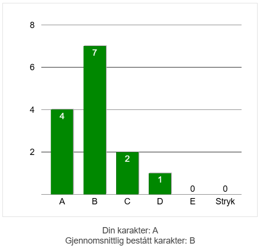

# Student Appendix: Tobias Rade Evensen
My name is [Tobias Rade Evensen](https://tobiasrade.no). These are my experiences from taking JUS5080 Programming for Lawyers, at UiO the autumn of 2024. I have previously taken subjects [IN1000](https://folkeliggjort.no/emneside/in1000-introduksjon-til-objektorientert-programmering/) and [IN1010](https://folkeliggjort.no/emneside/in1010-objektorientert-programmering/), which cover much of the same (and more). 

For the exam, there were 3 assignments which could be delivered on Canvas to get feedback, and then had to be delivered through panopto being 40% of the grade. There was then a 3 hour written exam at Silurveien which was 60% of the grade. 

Here are the assignments, my delivery of them for feedback, and the feedback I got.
- [Assignment 1 – The Assignment (Details) – JUS5080 Autumn 2024](assignment1_assignment.md)
- [Assignment 1 – Submission for Feedback – JUS5080 Autumn 2024](assignment1.ipynb)
- [Assignment 1 – Feedback – JUS5080 Autumn 2024](assignment1_feedback.md)
- [Assignment 2 – The Assignment (Details) – JUS5080 Autumn 2024](assignment2_assignment.md)
- [Assignment 2 – Submission for Feedback – JUS5080 Autumn 2024](assignment2.ipynb)
- [Assignment 2 – Feedback – JUS5080 Autumn 2024](assignment2_feedback.md)
- [Assignment 3 – The Assignment (Details) – JUS5080 Autumn 2024](assignment3_assignment.md)
- [Assignment 3 – Submission for Feedback – JUS5080 Autumn 2024](assignment3.ipynb)
- [Assignment 3 – Feedback – JUS5080 Autumn 2024](assignment3_feedback.md)

I then implemented the feedback and submitted the final portfolio for assessment. Here is my final portfolio.
- {Download}`Portfolio Assessment with Answer (A) – JUS5080 Autumn 2024.zip<Portfolio Assessment with Answer (A) – JUS5080 Autumn 2024.zip>`

I then sat the 3 hour school exam. Here is my answer to the exam.
- {Download}`Written Exam with Answer (A) – JUS5080 Autumn 2024.pdf<Written Exam with Answer (A) – JUS5080 Autumn 2024.pdf>`

My final results were an A. 

Here is a chart of the spread of exam results.

There are a maximum of 35 students in this course. The total amount of students completing the exams according to this graph is 14. The course isn't mandatory and can be replaced by other courses. I know of one student quitting the course. It seemed like the students considered the course to be hard. 

It is safe to assume that the students which found the course to be the hardest, are more highly represented amongst the students who dropped out than those who didn't. Looking at the chart, it seems like the students who found the course to be hard, misunderstood what was expected of them, because of there being few students who got a grade below B, and even fewer below a C. 

It could also be the case that the course is less rewarding for those who find it hard or less fun, and that these students don't see a way out of feeling this way. 

It could also be the case that fewer than 35 students were admitted to the course because of low demand. 

I would have had more reflections on this subject if I had participated in the lectures and seminars. It is interesting when a course gets less than half of the possible amount of students sitting the exam. 

The curriculum was:
- Python for everyone, Pages 1-390, except 2.6 & 4.10 Graphics (370 pages)
- Software development with Data Protection by Design and by Default.pdf (Article from Datatilsynet)

[There were lecture notes on github.](https://uio-cell.github.io/programming-for-lawyers/docs/index.html) It should be possible to go back in time and look at them as they were when I took the subject. Here is a short summary of what they covered:
- Arithmetic operations
- printing
- variables
	- the convention of writing variables which are meant to be constants, in all capital letters
- statements and expressions
- datatypes str, int and float
	- converting
- calling functions and methods
- input (we should check if input is valid)
- importing libraries and modules
	- datetime
		- date.today()
		- strptime(time, timeformat)
		- time.year, .day
- string concatenation
- f-strings
- if-statements (including else, elif and nesting)
- Relational operators
	- Including comparing strings– Larger strings come later in the alphabet
- datatype boolean
- boolean operators (and, or)
- operators in and not in (works for text, is case sensitive)
- lists  (including nested)
	- .index(value) is useful for finding item number x
	- new_list = list(old_list) actually copies a list
- loops (for and while, including nested)
- defining functions (and documenting with first a general description, and then a description of params)
- variable scope and the main function (def then call main)
- dictionaries (including nested)
	- .get(key, *default*) avoids error when key not in dict
- opening files
	- with open(filename, encoding='UTF-8) as file:
	- file.readline()
- writing files
	- with open(filename, 'w') as outfile:
	- print(value, file=outfile)
- try except
- raise
- opening directories
	- from pathlib import Path
	- directory = Path('directoryname')
	- for file in directory.iterdir()
	- filenames = directory.glob('*.txt')
- pandas
	- import pandas
	- table = DataFrame(\[\[1.1,1.2,1.3\], \[2.1,1.2,2.3\]\])
	- table.index = \['row name 1', 'row name 2'\]
	- table.columns = \['column name 1', 'column name 2'\]
	- read_csv(filename, *index_col='column name'*)
	- .head() – first 5 rows of a table
	- selection = cases.loc\['row name'\]
	- selection = cases\['column name'\]
		- selection = cases.loc\[:,'column name'\]
	- selection = cases.iloc[] # for rad eller kolonne n
	- selection = filter(regex, axis)
	- .str.contains(value)
	- .isin(value)
	- .valuecounts()
	- .plot(kind)
	- .sum(axis)
- sorting
	- sort(list) → new list
	- list.sort(*reverse*) → same list
		- key
- list comprehension
	- adhoc_judges = \[judge for judge in judges if 'ad hoc' in judge\] # Gir mening når du ser på hva setningen erstatter. Erstatter adhoc_judges = \[\]; for judge in judges: if 'adhoc' in judge: adhoc_judges.append(judge). Slik jeg ser dette så er første judge i list-comprehension-skrivemåten den siste judge i det setningen erstatter, og så kommer for-løkken og if-statementen. 
- sets – a collection of unique items where order doesn't matter
	- my_set = set(*list*) # if given a list, will convert the list
	- set.add(value)
- tuples – non modifyable list
	- my_tuple = (value1, value2, value3)
- re
	- import re
	- re.findall(pattern, string)
	- character classes
	- quantifiers
	- or
	- grouping (with parenthesis)
	- ignoring case – re.findall(pattern, string, falgs=re.IGNORECASE)
	- anchors (^ beginning € end \b boundary)

I did spend some time adpating my work to Jupyter Book for this Student Appendix, but the formatting can still be improved. hope that my contribution inspires others to contribute, and to keep working on finding the best format for a Student Appendix such as this. If your are interested in programming, contributing to these lecture notes can be a nice exercise for learning how to use git, GitHub and Jupyter Book. 